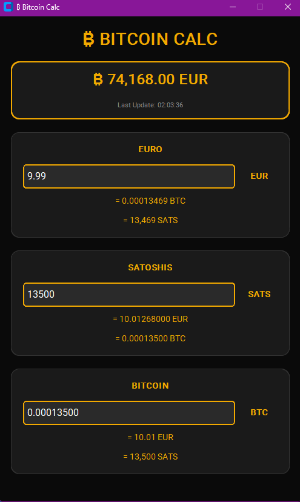

# ₿ Bitcoin Calc

**Professional Bitcoin Calculator with Live Price & Glow Effects**

[](https://opensource.org/licenses/MIT)
[](https://www.python.org/downloads/)
[](https://nodewatch21.io)

> A beautiful, modern Bitcoin calculator for instant EUR/BTC/SATS conversions with live price tracking.



---

## ✨ Features

- **💰 Live Bitcoin Price** - Real-time EUR price updates every 30 seconds via CoinGecko API
- **🔄 Instant Conversions** - EUR ↔ BTC ↔ SATS with automatic calculations as you type
- **🎨 Beautiful Design** - Bitcoin-Orange glow effects with modern dark theme
- **⚡ Lightning Fast** - Instant calculations, no lag
- **🖥️ Portable** - Single .exe file, no installation needed
- **🆓 100% Free** - Open source and free to use

---

## 🚀 Download

**Latest Release: v1.0.0**

### Windows

Download the latest version:
- [BitcoinRechner.exe](https://github.com/YOUR_USERNAME/bitcoin-rechner/releases/download/v1.0.0/BitcoinRechner.exe) (~45 MB)

Double-click to run - no installation required!

### Run from Source

```bash
# Clone repository
git clone https://github.com/YOUR_USERNAME/bitcoin-rechner.git
cd bitcoin-rechner

# Install dependencies
pip install -r requirements.txt

# Run the app
python bitcoin_rechner.py
```

---

## 💡 How to Use

1. **Launch the app** - Double-click `BitcoinRechner.exe`
2. **Wait for price to load** (~2 seconds)
3. **Type in any field:**
   - Enter EUR amount → See BTC + SATS
   - Enter BTC amount → See EUR + SATS
   - Enter SATS amount → See EUR + BTC
4. **Live updates** - Bitcoin price updates automatically every 30 seconds
5. **Instant results** - Conversions happen as you type!

---

## 🎨 Design

- **Bitcoin-Orange Theme** - Signature Bitcoin color (#f2a900)
- **Glow Effects** - Modern, cyberpunk-inspired UI
- **Dark Mode** - Easy on the eyes for long sessions
- **Clean Layout** - Intuitive, distraction-free interface

---

## 🛠️ Tech Stack

- **Python 3.8+**
- **CustomTkinter** - Modern GUI framework
- **Pillow (PIL)** - Icon generation
- **Requests** - API integration
- **CoinGecko API** - Real-time Bitcoin price data (free, no API key needed)

---

## 📦 Build from Source

Want to build the .exe yourself?

```bash
# Install build dependencies
pip install -r requirements.txt
pip install pyinstaller pillow

# Create Bitcoin icon
python create_icon.py

# Build executable (Windows)
pyinstaller --onefile --windowed --name="BitcoinRechner" --version-file=version_info.txt --icon=bitcoin_icon.ico bitcoin_rechner.py

# Find your .exe in dist/
```

---

## 🔮 Roadmap

### Current Version (v1.0.0)
- ✅ EUR/BTC/SATS conversion
- ✅ Live price tracking
- ✅ Glow design
- ✅ Auto-updates

### Planned Features (v2.0 - Premium)
- 🔜 Multi-currency support (USD, CHF, GBP, etc.)
- 🔜 Fee calculator (sats/vByte)
- 🔜 DCA planning tool
- 🔜 Lightning Network helpers
- 🔜 Price alerts
- 🔜 Historical charts

---

## 🤝 Contributing

Contributions are welcome! Feel free to:

- 🐛 Report bugs
- 💡 Suggest features
- 🔧 Submit pull requests
- ⭐ Star this repo

---

## 📄 License

This project is licensed under the MIT License - see the [LICENSE](LICENSE) file for details.

---

## 👨‍💻 Author

**Michael Steiner**

- Building: [NodeWatch21](https://nodewatch21.io) - Bitcoin Node Monitoring SaaS
- Twitter: [@NodeWatch21](https://twitter.com/NodeWatch21)
- GitHub: [@YOUR_USERNAME](https://github.com/YOUR_USERNAME)

---

## 🧡 Support

If you find this tool useful:

- ⭐ Star this repository
- 🐦 Share on Twitter
- ⚡ Tip via Lightning: [YOUR_LIGHTNING_ADDRESS]
- 💬 Give feedback

---

## 🙏 Acknowledgments

- Built with Python & CustomTkinter
- Price data from [CoinGecko API](https://www.coingecko.com)
- Inspired by the Bitcoin community 🧡

---

## ⚠️ Disclaimer

This tool is for informational purposes only. Not financial advice. Always do your own research (DYOR).

---

**Made with ₿ by Michael | NodeWatch21**

*Building in Public* 🚀

---

## 📊 Stats


